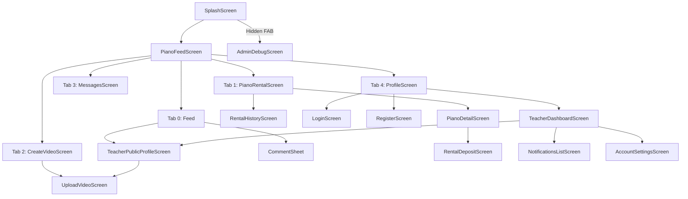
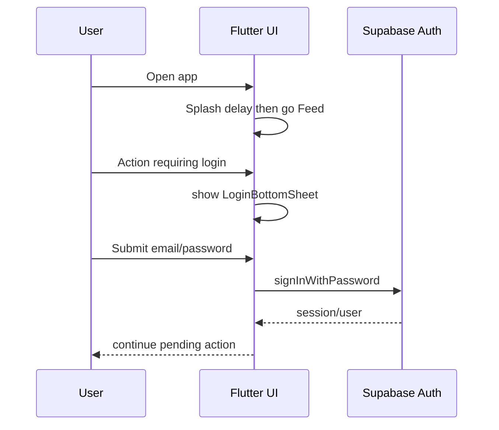
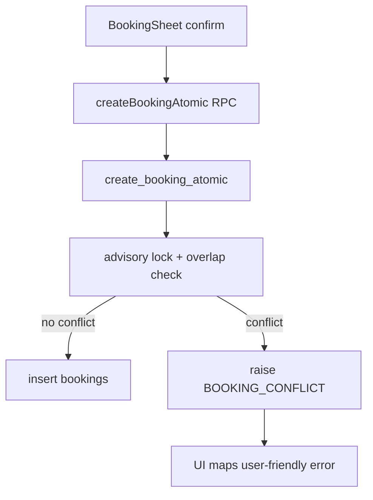
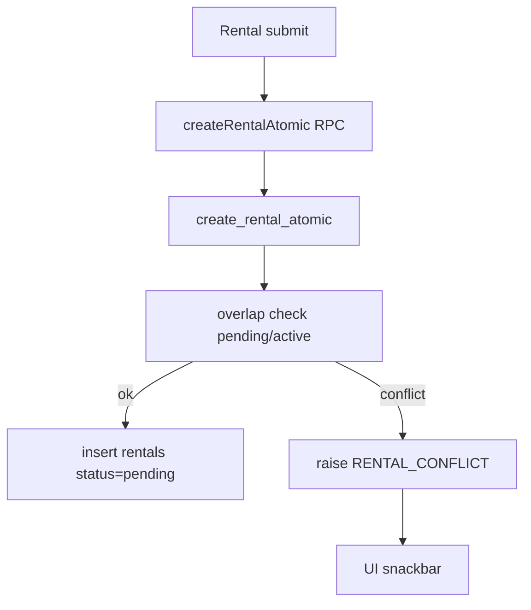
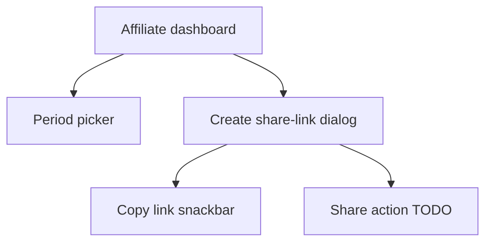

# Architecture and Workflow Map

Project: Xpiano Flutter app  
Generated from repository scan (code-first evidence only).

---

## 0) Scan Plan

### Scope scanned
- `mobile/lib/`
- `mobile/scripts/`
- `mobile/test/`
- `mobile/pubspec.yaml`
- `mobile/README.md`

### Query patterns used
```bash
rg -n "class\s+\w+Screen\b" mobile/lib
rg -n "Navigator\.push|MaterialPageRoute|IndexedStack|PageView\.builder|BottomNavigationBar" mobile/lib
rg -n "from\('|rpc\('|storage\.from\('" mobile/lib/services mobile/lib/features
rg -n "createBookingAtomic|createRentalAtomic|recordView|toggleFollow|logShareEvent" mobile/lib
rg -n "onPressed: null|onPressed:\s*\{\s*\}|onTap:\s*\{\s*\}|TODO|UnimplementedError|_showSimpleMessage" mobile/lib
rg -n "enable row level security|create policy|create table|create or replace function" mobile/scripts
```

---

## 1) Executive Summary

1. App architecture is Flutter UI -> service/repository -> Supabase Auth/DB/Storage/RPC (`mobile/lib/main.dart:56`, `mobile/lib/services/supabase_service.dart`).
2. App entry always goes Splash -> Feed; login is optional for browse (`mobile/lib/screens/splash_screen.dart:21-33`).
3. Feed uses vertical `PageView`, video playback widget, current+next preload behavior (`mobile/lib/main.dart:975`, `mobile/lib/widgets/feed_media_item.dart:32-33`).
4. Feed data is cursor-paginated by `(created_at, id)` with page size 12 and near-end prefetch (`mobile/lib/main.dart:131,213-255`; `mobile/lib/services/supabase_service.dart:387-432`).
5. Social interactions (like/comment/save/share/view/follow) are mostly real DB/RPC, not mock-only.
6. Upload flow is real: upload MP4 to `videos-feed` bucket then insert `social_feed` row (`mobile/lib/screens/upload_video_screen.dart:737-747`).
7. Booking and rental use atomic RPC calls from Flutter (`mobile/lib/screens/booking_screen.dart:307`, `mobile/lib/screens/rental_deposit_screen.dart:166`).
8. No dedicated backend server layer exists; client talks directly to Supabase.
9. Main risks: hard-coded secrets, schema drift around `social_feed.id`, placeholder actions, text encoding issues.
10. Current state is dev-MVP+, not production-ready.

---

## 2) Navigation Graph



Evidence:
- Root tabs: `mobile/lib/main.dart:831-851`
- Feed to public profile/comment: `mobile/lib/main.dart:567-599`
- Create -> upload: `mobile/lib/screens/create_video_screen.dart:475`
- Profile -> teacher dashboard: `mobile/lib/screens/profile_screen.dart:164`
- Hidden admin paths: `mobile/lib/screens/splash_screen.dart:76-85`, `mobile/lib/screens/profile_screen.dart:236-246`

---

## 3) Domain Workflows

### A) Auth workflow



Evidence:
- Splash route behavior: `mobile/lib/screens/splash_screen.dart:21-33`
- Login gate helper: `mobile/lib/main.dart` (`_checkLogin`, around line 780)
- Auth methods: `mobile/lib/services/supabase_service.dart:40-95`

### B) Social workflow (feed + interactions + upload)

```mermaid
flowchart TD
  F0[Feed init] --> F1[getSocialFeedPage(limit=12,cursor)]
  F1 --> F2[Render PageView vertical]
  F2 --> F3[onPageChanged]
  F3 --> F4[start 2s timer]
  F4 -->|>=2s| F5[rpc record_view]

  F2 --> L1[Double tap]
  L1 --> L2[rpc increment_social_feed_likes]

  F2 --> C1[Tap comment]
  C1 --> C2[Comment sheet]
  C2 --> C3[insert comments]

  F2 --> S1[Tap save]
  S1 --> S2[saved_posts upsert/delete]

  F2 --> SH1[Tap share]
  SH1 --> SH2[native share sheet]
  SH2 --> SH3[insert share_events]

  U0[Upload video] --> U1[storage upload videos-feed]
  U1 --> U2[insert social_feed row]
```

Evidence:
- Feed page load and pagination: `mobile/lib/main.dart:164-255`
- Gestures and like: `mobile/lib/main.dart:421-550`
- Comment/save/share: `mobile/lib/main.dart:581-691`
- View tracking: `mobile/lib/main.dart:1811-1859`
- Upload + create post: `mobile/lib/screens/upload_video_screen.dart:737-747`
- Supabase methods: `mobile/lib/services/supabase_service.dart:272-517,756-1018`

### C) Booking workflow



Evidence:
- FE call: `mobile/lib/screens/booking_screen.dart:307`
- Service call: `mobile/lib/services/supabase_service.dart:588-621`
- SQL RPC: `mobile/scripts/booking_atomic_setup.sql:24-104`

### D) Rental workflow



Evidence:
- FE call: `mobile/lib/screens/rental_deposit_screen.dart:166`
- Service call: `mobile/lib/services/supabase_service.dart:680-715`
- SQL RPC: `mobile/scripts/rentals_setup.sql:120-207`

### E) Affiliate workflow



Evidence:
- UI handlers only: `mobile/lib/screens/affiliate_dashboard_screen.dart:1262-1416`
- TODO exists: `mobile/lib/screens/affiliate_dashboard_screen.dart:1416`

---

## 4) Data Map

### 4.1 Tables map

| Table | Read from | Write from | Access mode | Screens/features | Notes |
|---|---|---|---|---|---|
| `social_feed` | `supabase_service.dart:387-432,477-517` | `supabase_service.dart:348-367` | Direct DB | Feed/upload | ID type drift handling present |
| `comments` | `supabase_comments_repository.dart:16-19` | `supabase_comments_repository.dart:53-60` | Direct DB | Comment sheet | FK type depends on DB state |
| `saved_posts` | `supabase_service.dart:896-897` | `supabase_service.dart:916,932` | Direct DB | Save feature | User-scoped |
| `share_events` | `supabase_service.dart:1002-1003` | `supabase_service.dart:944` | Direct DB | Share tracking | Count synced with aggregate |
| `video_views` | via RPC | via RPC | RPC | View tracking | Dedupe in SQL |
| `follows` | `supabase_service.dart:457-458,806-807` | `toggle_follow` RPC | Mixed | Follow/following feed | |
| `teacher_profiles` | `supabase_service.dart:227-259,1083-1150` | `supabase_service.dart:199,211,1126` | Direct DB | Teacher/profile/admin | |
| `pianos` | `supabase_service.dart:562-573` | scripts alter columns | Direct read | Rental inventory | |
| `bookings` | `supabase_service.dart:645-646` | RPC create + direct update | Mixed | Booking | RLS script exists in repo |
| `rentals` | `supabase_service.dart:723-724` | RPC create + direct update | Mixed | Rental | RLS script exists in repo |

### 4.2 RPC map

| RPC | Called from | Purpose |
|---|---|---|
| `create_booking_atomic` | `supabase_service.dart:600` | Atomic booking create |
| `create_rental_atomic` | `supabase_service.dart:693` | Atomic rental create |
| `increment_social_feed_likes` | `supabase_service.dart:760` | Atomic like increment |
| `increment_likes` | `supabase_service.dart:768` | Fallback like RPC |
| `toggle_follow` | `supabase_service.dart:829` | Follow/unfollow |
| `get_profile_stats` | `supabase_service.dart:856` | Followers/following/posts stats |
| `record_view` | `supabase_service.dart:972` | View dedupe + increment |

### 4.3 Storage map

| Bucket | Used from | Path style | URL style | Notes |
|---|---|---|---|---|
| `teacher-profiles` | `supabase_service.dart:151,155,178` | `{userId}/{folder}/{fileName}` | `getPublicUrl` | public/private runtime unknown from repo |
| `videos-feed` | `supabase_service.dart:289`, setup in `social_feed_video_upload_setup.sql` | `test/{userId}/{timestamp}_{safeTitle}.mp4` (`upload_video_screen.dart:728-735`) | `getPublicUrl` | script sets bucket public |

CDN conclusion from code: no custom CDN domain abstraction; serving via Supabase Storage URL.

### 4.4 Migration/RLS files present in repo

- `mobile/scripts/social_feed_video_upload_setup.sql`
- `mobile/scripts/comments_setup.sql`
- `mobile/scripts/saved_share_setup.sql`
- `mobile/scripts/video_views_setup.sql`
- `mobile/scripts/follows_setup.sql`
- `mobile/scripts/booking_atomic_setup.sql`
- `mobile/scripts/booking_rls_setup.sql`
- `mobile/scripts/rentals_setup.sql`
- `mobile/scripts/social_feed_like_rpc.sql`

Important: repo contains SQL files, but execution status in live DB is unknown unless introspected.

---

## 5) Action Audit (Top 30)

| # | Action | Status | Evidence | Behavior |
|---|---|---|---|---|
| 1 | Feed vertical scroll | REAL | `mobile/lib/main.dart:975` | `PageView.builder` vertical |
| 2 | Feed pagination near end | REAL | `mobile/lib/main.dart:213-255` | Auto-load more |
| 3 | Tap play/pause | REAL | `mobile/lib/main.dart:421-461` | Immediate toggle |
| 4 | Long press pause/resume | REAL | `mobile/lib/main.dart:463-495` | Hold to pause |
| 5 | Double tap like | REAL | `mobile/lib/main.dart:497-520` | Optimistic + animation |
| 6 | Like backend sync | REAL | `mobile/lib/main.dart:522-550`, `supabase_service.dart:756-779` | RPC |
| 7 | Open creator profile | REAL | `mobile/lib/main.dart:570,1304+` | Push profile screen |
| 8 | Open comment sheet | REAL | `mobile/lib/main.dart:581-599` | Modal bottom sheet |
| 9 | Post comment | REAL | `mobile/lib/features/comments/comment_sheet.dart:78-132` | Insert + rollback |
| 10 | Save toggle | REAL | `mobile/lib/main.dart:601-655` | Insert/delete saved post |
| 11 | Load saved state | REAL | `mobile/lib/main.dart:303-314` | Fetch saved IDs |
| 12 | Share native dialog | REAL | `mobile/lib/main.dart:657-671` | `share_plus` |
| 13 | Share event DB log | REAL | `mobile/lib/main.dart:671`, `supabase_service.dart:944` | Insert event |
| 14 | Share count DB sync | REAL | `mobile/lib/main.dart:317-336` | Aggregate from DB |
| 15 | View tracking >=2s | REAL | `mobile/lib/main.dart:1811-1859` | Timer + RPC |
| 16 | Following tab | REAL | `mobile/lib/main.dart:1155-1209` | Filtered feed |
| 17 | Following guest gate | REAL | `mobile/lib/main.dart:921-970` | Login prompt |
| 18 | Create -> upload | REAL | `mobile/lib/screens/create_video_screen.dart:475` | Navigate upload |
| 19 | Upload MP4 storage | REAL | `mobile/lib/screens/upload_video_screen.dart:737-740` | Storage upload |
| 20 | Create social post | REAL | `mobile/lib/screens/upload_video_screen.dart:742-747` | Insert row |
| 21 | Follow toggle | REAL | `mobile/lib/screens/teacher_public_profile_screen.dart:139-179` | RPC follow |
| 22 | Profile stats load | REAL | `mobile/lib/services/supabase_service.dart:846-887` | RPC stats |
| 23 | Booking create | REAL | `mobile/lib/screens/booking_screen.dart:307` | RPC atomic |
| 24 | Rental create | REAL | `mobile/lib/screens/rental_deposit_screen.dart:166` | RPC atomic |
| 25 | Account: change password | DUMMY | `mobile/lib/screens/account_settings_screen.dart:51,289-291` | Snackbar only |
| 26 | Account: bank link | DUMMY | `mobile/lib/screens/account_settings_screen.dart:58,289-291` | Snackbar only |
| 27 | Account: 2FA | DUMMY | `mobile/lib/screens/account_settings_screen.dart:64,289-291` | Snackbar only |
| 28 | Affiliate copy link | PARTIAL | `mobile/lib/screens/affiliate_dashboard_screen.dart:1380-1390` | Snackbar, no real copy API |
| 29 | Affiliate share | DUMMY | `mobile/lib/screens/affiliate_dashboard_screen.dart:1414-1416` | TODO |
| 30 | Mark all notifications read | DUMMY | `mobile/lib/screens/notifications_list_screen.dart:161-162` | Snackbar only |

Additional dummy/empty callbacks:
- `mobile/lib/screens/login_screen.dart:204,212`
- `mobile/lib/screens/piano_detail_screen.dart:101,631,771`
- `mobile/lib/screens/messages_screen.dart:417-420`
- `mobile/lib/screens/chat_detail_screen.dart:1054-1057`

---

## 6) Risks and Bottlenecks (minimum-fix view)

1. Hard-coded Supabase URL/key (`mobile/lib/main.dart:29-31`) -> move to `--dart-define`.
2. Hard-coded SMTP password (`mobile/lib/services/email_service.dart:10`) -> remove from client.
3. Hidden admin/debug paths reachable in release (`splash_screen.dart:76-85`, `profile_screen.dart:236-246`) -> guard with `kDebugMode`.
4. `social_feed.id` schema drift (text vs bigint handling code) (`supabase_service.dart:1054-1065`) -> unify type.
5. `feed_id` type inconsistency across scripts -> normalize all feed foreign keys.
6. Manual ID generation race condition (`_nextTextSocialFeedId`) -> use DB sequence/identity.
7. Read-modify-write helper methods still present (`supabase_service.dart:781-799`) -> remove/deprecate.
8. SQL files may not be applied to live DB -> enforce migration tooling and checks.
9. Follow select policy broad (`follows_setup.sql`) -> tighten privacy policy.
10. Public storage exposure for videos -> evaluate signed URL/CDN policy.
11. No provider abstraction for media URL serving -> add playback URL abstraction.
12. Video detail screen is image-mock, not real player (`video_player_detail_screen.dart:103-145`) -> align with feed player.
13. Text encoding/mojibake on many UI strings -> normalize UTF-8 and string audit.
14. `BookingScreen` appears not wired from navigation (`rg BookingScreen(` only definition) -> wire or remove.
15. Test coverage near zero (`mobile/test/widget_test.dart`) -> add integration tests for feed/upload/booking.
16. Error handling is fragmented across many `SnackBar` usages -> centralize error mapping.
17. Affiliate domain mostly UI-only with TODO -> mark clearly as stub or implement minimal backend.
18. Direct client writes for key business tables -> gradually move critical writes to RPC-only.

---

## 7) What to Check Next in Supabase (read-only SQL)

```sql
select column_name, data_type, is_nullable
from information_schema.columns
where table_schema = 'public' and table_name = 'social_feed'
order by ordinal_position;
```

```sql
select table_name
from information_schema.tables
where table_schema = 'public'
  and table_name in ('social_feed','comments','saved_posts','share_events','video_views','follows','bookings','rentals','pianos','teacher_profiles')
order by table_name;
```

```sql
select schemaname, tablename, rowsecurity
from pg_tables
where schemaname='public'
  and tablename in ('social_feed','comments','saved_posts','share_events','video_views','follows','bookings','rentals','pianos','teacher_profiles')
order by tablename;
```

```sql
select schemaname, tablename, policyname, permissive, roles, cmd, qual, with_check
from pg_policies
where schemaname in ('public','storage')
order by schemaname, tablename, policyname;
```

```sql
select n.nspname as schema, p.proname as function_name, pg_get_function_identity_arguments(p.oid) as args
from pg_proc p
join pg_namespace n on n.oid = p.pronamespace
where n.nspname='public'
  and p.proname in ('create_booking_atomic','create_rental_atomic','record_view','toggle_follow','get_profile_stats','increment_social_feed_likes','increment_likes')
order by p.proname;
```

```sql
select schemaname, tablename, indexname, indexdef
from pg_indexes
where schemaname='public'
  and tablename in ('social_feed','video_views','bookings','rentals','follows','saved_posts','share_events','comments')
order by tablename, indexname;
```

```sql
select tc.table_name, kcu.column_name, ccu.table_name as ref_table, ccu.column_name as ref_column
from information_schema.table_constraints tc
join information_schema.key_column_usage kcu
  on tc.constraint_name = kcu.constraint_name and tc.table_schema = kcu.table_schema
join information_schema.constraint_column_usage ccu
  on ccu.constraint_name = tc.constraint_name and ccu.table_schema = tc.table_schema
where tc.table_schema='public' and tc.constraint_type='FOREIGN KEY'
  and (kcu.column_name in ('feed_id','author_id') or ccu.table_name='social_feed')
order by tc.table_name, kcu.column_name;
```

```sql
select id, name, public, file_size_limit, allowed_mime_types
from storage.buckets
order by id;
```

```sql
select schemaname, tablename, policyname, cmd, roles, qual, with_check
from pg_policies
where schemaname='storage' and tablename='objects'
order by policyname;
```

```sql
select
  count(*) as total_posts,
  count(*) filter (where author_id is null) as posts_without_author,
  count(*) filter (where media_type='video') as video_posts,
  count(*) filter (where media_type='image') as image_posts
from public.social_feed;
```

---

## 8) Quick classification legend

- REAL: action causes actual navigation/DB/RPC/storage effect.
- PARTIAL: action has behavior but incomplete persistence or incomplete integration.
- DUMMY: placeholder/snackbar-only/empty callback/TODO.

